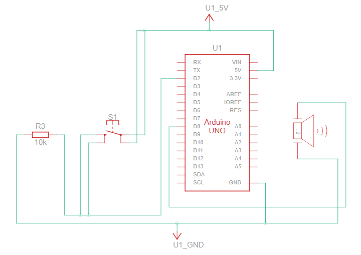

# Doorbell Using The Passive Buzzer and Button To Play The Mii Theme
This project uses an Arduino Uno R3 to create a doorbell that plays the Mii theme song when a button is pressed.

## Components Required
- Arduino Uno R3
- Pushbutton
- Passive buzzer
- 10 kΩ Resistor
- Jumper wires
- Breadboard

## Schematics Diagram

## Connections
- **Pushbutton:**
  - One leg to Arduino digital pin 2
  - Other leg to one end of the 10 kΩ resistor
  - Other end of the 10 kΩ resistor to Arduino GND
  - Other leg of the pushbutton directly to Arduino 5V
  
- **Piezo:**
  - Positive lead to Arduino digital pin 8
  - Negative lead to Arduino GND
 
## Usage
  - Build the circuit following the wiring instructions and the circuit diagram.
  - Upload the code to your Arduino Uno R3.
  - Press the button to play the Mii theme song.

## Inspired by:
- https://www.instructables.com/Arduino-Doorbell/ 
